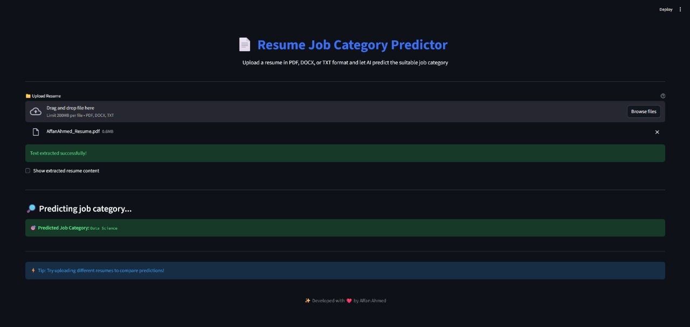

# Automated Resume Screening

## 📝 Description

This project is an **AI-powered tool** that automates the initial screening of resumes by classifying them into one of 25 predefined job categories.

It uses a **Machine Learning model** (trained in `Resume Screening Code.ipynb`) to analyze the text content of an uploaded resume and predict the most suitable job category. The application is deployed via a user-friendly web interface built with **Streamlit**.

## ✨ Features

* **Multi-Format Support:** Accepts resume uploads in **PDF**, **DOCX**, and **TXT** formats.
* **AI-Driven Prediction:** Utilizes a pre-trained classification model to instantly predict the job category.
* **Extensive Categories:** The model is trained to classify resumes across **25 distinct job categories**, including Data Science, HR, Java Developer, DevOps Engineer, Testing, and more.
* **Text Preprocessing:** Automatically cleans and processes the raw resume text (e.g., removing URLs, special characters, and performing stop-word removal) before prediction.

## 📸 Application Screenshot

Here's a glimpse of the web application in action:



## 🛠️ Technologies Used

The core of the project is built using Python and the following key libraries:

| Technology | Purpose |
| :--- | :--- |
| **Python** | Primary development language |
| **Streamlit** | Web application framework for deployment |
| **Scikit-learn (via Pickle)** | Machine Learning model (Classifier, TF-IDF Vectorizer, Label Encoder) |
| **Pandas & NumPy** | Data manipulation and analysis |
| **PyPDF2 & python-docx** | Extracting text from PDF and DOCX files |
| **NLTK** | Natural Language Processing tasks (tokenization, stop-word removal) |

## 🚀 Installation and Setup

### Prerequisites

* Python 3.8+
* `pip` (Python package installer)

### Setup Steps

1.  **Clone the repository:**
    ```bash
    git clone [https://github.com/your-username/automated-resume-screening.git](https://github.com/your-username/automated-resume-screening.git)
    cd automated-resume-screening
    ```

2.  **Create a virtual environment (Recommended):**
    ```bash
    python -m venv res
    source res/bin/activate  # On Linux/macOS
    # res\Scripts\activate   # On Windows
    ```

3.  **Install dependencies:**
    You will need a `requirements.txt` file listing all required packages (e.g., `streamlit`, `PyPDF2`, `python-docx`, `scikit-learn`, `pandas`, `nltk`).
    ```bash
    pip install -r requirements.txt
    ```

4.  **Download NLTK Data:**
    The `app.py` script automatically downloads the necessary `punkt` and `stopwords` data from NLTK.

## 💻 Usage

### 1. Training the Model (Optional)

The full training and data cleaning process can be reviewed and executed in the Jupyter Notebook:
* Open and run **`Resume Screening Code.ipynb`**.
* This notebook handles data loading from `UpdatedResumeDataSet.csv`, exploration, cleaning, and trains the final model, saving the necessary components (`clf.pkl`, `tfidf.pkl`, `encoder.pkl`).

### 2. Running the Web Application

To start the Streamlit application:

```bash
streamlit run app.py
